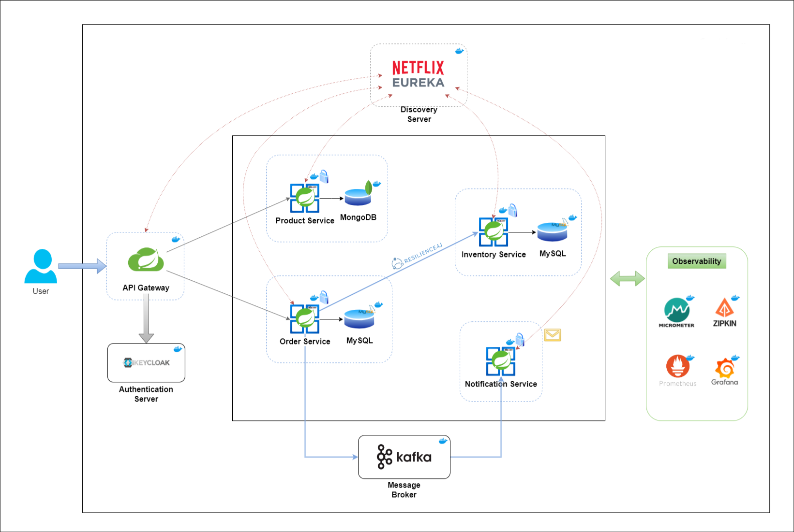

# 🌾 CropCog: E-Commerce Microservices Backend

This repository contains the backend for **CropCog**, an e-commerce platform operated by [Ananth Agri Services LLP](https://ananthagriservices.in). The backend system is built using a microservices architecture powered by Spring Boot, designed for scalability, observability, and extensibility.

This project is being developed as part of an ongoing internship at Ananth Agri Services LLP, where the legacy e-commerce backend is being re-engineered into a modular Spring Boot microservices system.

---

## 🧩 Architecture Overview

CropCog is designed with modular, domain-focused services:

- **Spring Boot**: Core framework for microservices
- **Spring Cloud Netflix Eureka**: Service discovery
- **Spring Cloud Gateway**: API routing
- **Keycloak**: Authentication and authorization
- **Apache Kafka**: Asynchronous messaging (event-driven communication)
- **Resilience4j**: Circuit breaking for fault tolerance
- **Micrometer + Zipkin**: Distributed tracing
- **Prometheus + Grafana**: Observability and monitoring

📐 **Solution Architecture**  


---

## 🔧 Services Summary

| Service               | Status       | Description |
|-----------------------|--------------|-------------|
| **Product Service**     | ✅ Completed | Product catalog management (MongoDB) |
| **Order Service**       | ✅ Completed | Order placement & tracking (MySQL) |
| **Inventory Service**   | 🟡 In Progress | Stock adjustments, availability (MySQL) |
| **Notification Service**| 🟡 In Progress | Sends async order updates (Kafka-based) |
| **API Gateway**         | ✅ Completed | Unified API entry point |
| **Discovery Server**    | ✅ Completed | Eureka registry |
| **Auth Server**         | ✅ Completed | Keycloak-based OAuth2 and client credentials |

---

## 🧰 Tech Stack

**Languages & Frameworks**  
Java, Spring Boot, Spring Cloud, Spring Security

**Databases & Messaging**  
MongoDB, MySQL, Apache Kafka

**Infrastructure**  
Docker, Docker Compose, Maven, Jib

**Security**  
Keycloak (OAuth2), Role-based access

**Observability**  
Micrometer, Zipkin, Prometheus, Grafana

---

## 🚀 Getting Started

### Prerequisites
- Docker & Docker Compose installed and running
- Java 17
- Maven

### Deployment Steps

```bash
# Clone the repo
git clone https://github.com/YOUR_USERNAME/cropcog-ecommerce-backend.git
cd cropcog-ecommerce-backend

# Build services locally
mvn compile jib:dockerBuild

# Start containers
docker compose up -d

# Confirm running
docker ps
```

---

## 🔐 Keycloak Setup (Auth)

1. Visit: `http://localhost:8080/`
2. Realm: `spring-boot-microservices-realm`
3. Client: `spring-cloud-client`
4. Get Client Secret under **Credentials**

> Tip: Add `127.0.0.1 keycloak` to your local `/etc/hosts` file

---

## 🧪 Postman Authentication (OAuth2.0)

| Field             | Value                                     |
|------------------|-------------------------------------------|
| Token Name        | `token`                                   |
| Grant Type        | `Client Credentials`                      |
| Access Token URL  | `http://keycloak:8080/realms/spring-boot-microservices-realm/protocol/openid-connect/token` |
| Client ID         | `spring-cloud-client`                     |
| Client Secret     | `<copied-from-Keycloak>`                  |

---

## 📡 API Samples

### POST /api/product

```http
POST http://localhost:8181/api/product
Authorization: OAuth 2.0 Bearer <token>
Content-Type: application/json

{
  "name": "Iphone 15",
  "description": "Apple Iphone 15",
  "price": 1500
}
```

### GET /api/product

```http
GET http://localhost:8181/api/product
Authorization: Bearer <token>
```

### POST /api/order

```http
POST http://localhost:8181/api/order
Authorization: Bearer <token>

{
  "orderLineItemsDtoList": [
    {
      "skuCode": "iphone_15_pro",
      "price": 2000,
      "quantity": 1
    }
  ]
}
```

---

## 📊 Monitoring Dashboards

- **Eureka UI** – `http://localhost:8761/`
- **Zipkin Traces** – `http://localhost:9411/zipkin/`
- **Prometheus** – `http://localhost:9090/`
- **Grafana** – `http://localhost:3000/`  
  Use `grafana-dashboard.json` to import dashboards

---

## 🧼 Environment Cleanup

```bash
docker compose down -v
```

---

## 🧾 Internship Context

> This project was developed by **Balaji** during his internship at [Ananth Agri Services LLP](https://ananthagriservices.in), as part of the backend re-architecture of their CropCog e-commerce platform.

---

## 📌 Planned Improvements

- [ ] User Service (sign-up, login, profile)
- [ ] Auth enhancements (JWT-based service-to-service auth)
- [ ] Cart Service (add/remove items)
- [ ] Payment Service (mocked or real)
- [ ] Full Docker-based CI/CD

---

## 📄 License

This project is open-sourced with permission from Ananth Agri Services LLP for portfolio, educational, and demonstration purposes.
